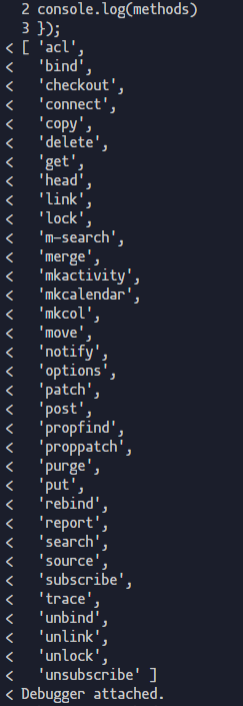

# koa-router

koa-router应该是最常使用的koa的路由库，其源码比较简单，而且有十分详细的注释与使用案例。使用方式也比tj大神的koa-route要简洁。

按照惯例，先看看koa-router的使用方法。

```javascript
var Koa = require('koa');
var Router = require('koa-router');

var app = new Koa();
var router = new Router();

router
  .get('/', (ctx, next) => {
    ctx.body = 'Hello World!';
  })
  .post('/users', (ctx, next) => {
    // ...
  })
  .put('/users/:id', (ctx, next) => {
    // ...
  })
  .del('/users/:id', (ctx, next) => {
    // ...
  })
  .all('/users/:id', (ctx, next) => {
    // ...
  });

app
  .use(router.routes())
  .use(router.allowedMethods());
```

首先对Router进行实例化，然后在实例化的对象进行路由的注册，最后通过`routes`和`allowedMethods`方法在koa上添加中间件。

还有一点需要注意的是router对象是支持链式调用，也就是每个方法最后都会`return this;`。

```javascript
var methods = require('methods');

// 构造函数
function Router(opts) {
  if (!(this instanceof Router)) {
    return new Router(opts);
  }

  this.opts = opts || {};
  this.methods = this.opts.methods || [
    'HEAD',
    'OPTIONS',
    'GET',
    'PUT',
    'PATCH',
    'POST',
    'DELETE'
  ];

  this.params = {};
  this.stack = [];
};

// 原型上注册 http 相关请求的方法
methods.forEach(function (method) {
  Router.prototype[method] = function (name, path, middleware) {
    var middleware;
    // 参数校验，判断是否传入name，并且将middleware转为数组
    if (typeof path === 'string' || path instanceof RegExp) {
      middleware = Array.prototype.slice.call(arguments, 2);
    } else {
      middleware = Array.prototype.slice.call(arguments, 1);
      path = name;
      name = null;
    }
    // 注册路由
    this.register(path, [method], middleware, {
      name: name
    });

    // 返回this，方便链式调用
    return this;
  };
});

// 为delete定义别名
Router.prototype.del = Router.prototype['delete'];
```

这里的methods是node所支持的http请求的方法(`require('http').METHODS`)，这里一共有二十多种请求方法。



但是可以看前面构造函数定义的`this.methods`只有7种请求方法，这是HTTP1.1协议中通用的请求方法（除了没有CONNECT）。这里定义的七种方法会在`allowedMethods`方法进行过滤，这个后面讲到`allowedMethods`方法的时候再细讲。

```javascrip
[
  'HEAD',
  'OPTIONS',
  'GET',
  'PUT',
  'PATCH',
  'POST',
  'DELETE'
]
```

这些请求方法首先进行了一些参数校验，最后会调用`register`方法进行路由的注册。

```javascript
// 注册路由
this.register(path, [method], middleware, {
  name: name
});

register = function (path, methods, middleware, opts) {}

```

这里register接受的methods参数是一个数组，表示一个路由可以绑定多个请求方法，所以koa-router还支持一个`all`方法，该方法会对一个路由注册所有的请求方法，即调用`register`的时候传入methods。

```javascript
Router.prototype.all = function (name, path, middleware) {
  this.register(path, methods, middleware, {
    name: name
  });
  return this;
};
```

同时path参数也支持数组的方式，如果想要更加灵活的注册路由，可以不调用这些请求方法，而是直接使用register。

```javascript
var Koa = require('koa');
var Router = require('koa-router');

var app = new Koa();
var router = new Router();

// register不支持链式调用
router.register(
  ['/test1', '/test2'], 
  ['get', 'post'],
  (ctx, next) => {
    ctx.body = 'Hello World!';
  });

app.use(router.routes())
```

下面直接看看register的源码部分：

```javascript
Router.prototype.register = function (path, methods, middleware, opts) {
  opts = opts || {};

  var router = this;
  var stack = this.stack; // 存储路由表的栈

  // 路径支持数组的形式
  if (Array.isArray(path)) {
    path.forEach(function (p) {
      router.register.call(router, p, methods, middleware, opts);
    });

    return this;
  }

  // 创建一个路由层，进行Layer实例化
  var route = new Layer(path, methods, middleware, {
    end: opts.end === false ? opts.end : true,
    name: opts.name,
    sensitive: opts.sensitive || this.opts.sensitive || false,
    strict: opts.strict || this.opts.strict || false,
    prefix: opts.prefix || this.opts.prefix || "",
    ignoreCaptures: opts.ignoreCaptures
  });

  // 设置路由前缀
  if (this.opts.prefix) {
    route.setPrefix(this.opts.prefix);
  }

  // 添加参数中间件
  Object.keys(this.params).forEach(function (param) {
    route.param(param, this.params[param]);
  }, this);

  stack.push(route);

  return route;
};
```

首先进行path参数校验，如果是数组，进行循环调用。

```javascript
if (Array.isArray(path)) {
  path.forEach(function (p) {
    router.register.call(router, p, methods, middleware, opts);
  });

  return this;
}
```

然后对`Layer`进行实例化，并放入到stack栈中，这个Layer的实例就是最终的路由层。

```javascript
var stack = this.stack; // 存储路由表的栈
var route = new Layer(path, methods, middleware, opts);
stack.push(route);
```

下面是`Layer`精简版的构造函数，关于Layer实例化的对象，我们只需要关心它的match方法，该方法使用了进行当前路径与路由进行匹配的。

```javascript
var pathToRegExp = require('path-to-regexp');
function Layer(path, methods, middleware, opts) {
  this.opts = opts || {};
  this.name = this.opts.name || null;
  this.methods = [];
  this.paramNames = [];
  this.stack = Array.isArray(middleware) ? middleware : [middleware];

  this.methods = methods.map(function(method) {
    return method.toUpperCase(); // 将方法名转成大写
  });

  this.path = path;
  // 根据路由路径生成正则
  this.regexp = pathToRegExp(path, this.paramNames, this.opts);
};

Layer.prototype.match = function (path) {
  return this.regexp.test(path);
};
```

这里的pathToRegExp方法，主要作用是将一个路由路径转成一个正则表达式，很多路由库都会依赖这方法，具体使用方式如下：

```javascript
var params = []
var regexp = pathToRegExp('/user/:id/:name?', params)
```

得到的结果：

```javascript
regexp = /^\/user\/([^\/]+?)(?:\/([^\/]+?))?(?:\/)?$/i
params = [
  {
    name: 'id',
    prefix: '/',
    delimiter: '/',
    optional: false,
    repeat: false,
    partial: false,
    pattern: '[^\\/]+?' 
  },
  {
    name: 'name',
    prefix: '/',
    delimiter: '/',
    optional: true,
    repeat: false,
    partial: false,
    pattern: '[^\\/]+?'
  }
]

'/user/1001/shenfq'.match(regexp) ===>
[
  '/user/1001/shenfq', 
  '1001', 
  'shenfq'
]
```

到这里，我们的流程已经把所有的路由实例全部存储到了stack栈中，接下来看看routes方法生成的中间件怎么进行路由匹配的。

```javascript
Router.prototype.routes = Router.prototype.middleware = function () {
  var router = this;

  var dispatch = function dispatch(ctx, next) {
    // 获取当前请求的路径
    var path = router.opts.routerPath || ctx.routerPath || ctx.path;
    // 根据路径匹配对应路由
    var matched = router.match(path, ctx.method);
    var layerChain, layer, i;

    ctx.router = router;

    // 如果没有匹配到路由，直接return
    if (!matched.route) return next();

    var matchedLayers = matched.pathAndMethod
    // 将所有匹配到的路由的所有回调中间件，集合到一个数组中
    layerChain = matchedLayers.reduce(function(memo, layer) {
      memo.push(function(ctx, next) {
        // 获取路由正则捕获的参数
        ctx.captures = layer.captures(path, ctx.captures);
        // 获取参数，并进行校验
        ctx.params = layer.params(path, ctx.captures, ctx.params);
        ctx.routerName = layer.name;
        return next();
      });
      // 中间件的合并
      return memo.concat(layer.stack);
    }, []);
    // 通过compose构造路由层的洋葱模型
    return compose(layerChain)(ctx, next);
  };

  dispatch.router = this;

  return dispatch;
};

Router.prototype.match = function (path, method) {
  var layers = this.stack;
  var layer;
  var matched = {
    pathAndMethod: [],
    route: false
  };
  // 遍历路由层
  for (var len = layers.length, i = 0; i < len; i++) {
    layer = layers[i];

    if (layer.match(path)) { // 判断当前路径是否与路由正则匹配
      // 判断请求方法是否与注册的请求方法匹配
      if (layer.methods.length === 0 || ~layer.methods.indexOf(method)) {
        matched.pathAndMethod.push(layer);
        if (layer.methods.length) matched.route = true;
      }
    }
  }

  return matched;
};
```
