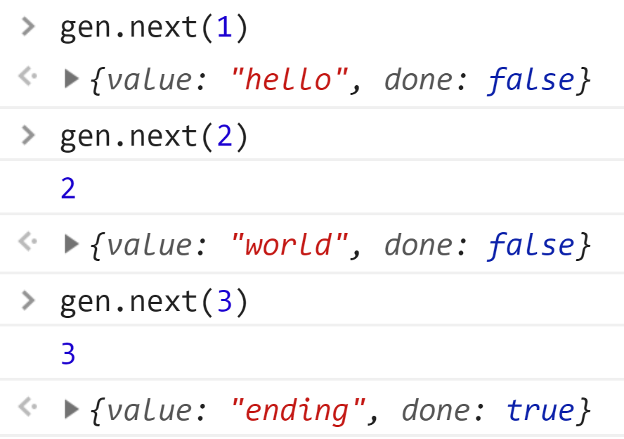

co这个模块用于koa1阶段，那个时候的中间件使用的是Generator函数，该函数不能自动执行，需要通过co进行包装。那么koa2为了兼容koa1的写法，在传入中间件的时候判断了是否为Generator函数。

```javascript
const convert = require('koa-convert');
if (isGeneratorFunction(fn)) {
    deprecate('Support for generators will be removed in v3. See the documentation for examples of how to convert old middleware https://github.com/koajs/koa/blob/master/docs/migration.md');
    fn = convert(fn);
}
```

这里有一个`koa-convert`模块，本质上就是调用co。

```javascript
const co = require('co')

function convert(mw) {
  const converted = function (ctx, next) {
    // 调用co模块
    return co.call(ctx, mw.call(ctx, createGenerator(next)))
  }
  converted._name = mw._name || mw.name
  return converted
}
function* createGenerator(next) {
  return yield next()
}
```

那么co的作用到底是什么呢？简单来说就是让Generator函数自动执行。首先我们先复习一下Generator函数的知识点。

```javascript
function* helloworld() {
  console.log(yield 'hello')
  console.log(yield 'world')
  return 'ending'
}
const gen = helloworld()
gen.next(1)
gen.next(2)
gen.next(3)
```



Generator函数在执行之后，得到一个迭代器，每次调用起next方法执行到yield停止。调用next返回一个对象，value属性表示当前yield后面的表达式返回的值，done属性表示当前迭代器是否结束，结束的标准就是碰return。同时next的能接受一个参数，该参数表示前一个yield的值，所以第一个next的参数其实是没有意义的。具体看一下上面的代码，并对照返回结果。

- 调用第一个next，返回了value为hello，函数运行遇到yield就会停止，`console.log`并没有执行。
- 调用第二个next，第一个`console.log`执行，打印出2，表示next的参数被前一个yield返回，并且返回的value为world。
- 调用第三个next，第二个`console.log`执行，打印出3，返回的value为ending，因为是return操作，所以done为true。

接下来看看co是如何让Generator函数自执行的，下面是co模块的简化版。

```javascript
function co(gen) {
  var ctx = this;
  var args = slice.call(arguments, 1);
  
  // 返回一个promise包裹所有的代码，避免promise的链式调用，解决promise的内存泄漏
  return new Promise(function (resolve, reject) {
    // 调用Generator，获取迭代器对象。
    if (typeof gen === 'function') gen = gen.apply(ctx, args);
    // 如果传入的函数不会Generator，直接resolve
    if (!gen || typeof gen.next !== 'function') return resolve(gen);

    onFulfilled();

    function onFulfilled(res) {
      var ret = gen.next(res);
      next(ret);
      return null;
    }

    function onRejected(err) {
      var ret = gen.throw(err);
      next(ret);
    }

    function next(ret) {
      // 如果返回的done为true，表示Generator进行了return，进行resolve不再遍历。
      if (ret.done) { 
        return resolve(ret.value);
      }
      // 将返回的值promise化
      var value = toPromise.call(ctx, ret.value);
      if (value && isPromise(value)) {
        // promise 完成后调用next进行递归
        return value.then(onFulfilled, onRejected);
      }
      // 如果不满足上述条件，进行错误处理
      return onRejected(new TypeError('You may only yield a function, promise, generator, array, or object, but the following object was passed: "' + String(ret.value) + '"'));
    }
  })
}
```

这个是最新的cov4的版本，只支持yield后面是promise，之前的版本还支持普通回调函数配合thunk，这里不做展开。

更完整的co源码请看： [链接](./src/koa-convert/co.js)